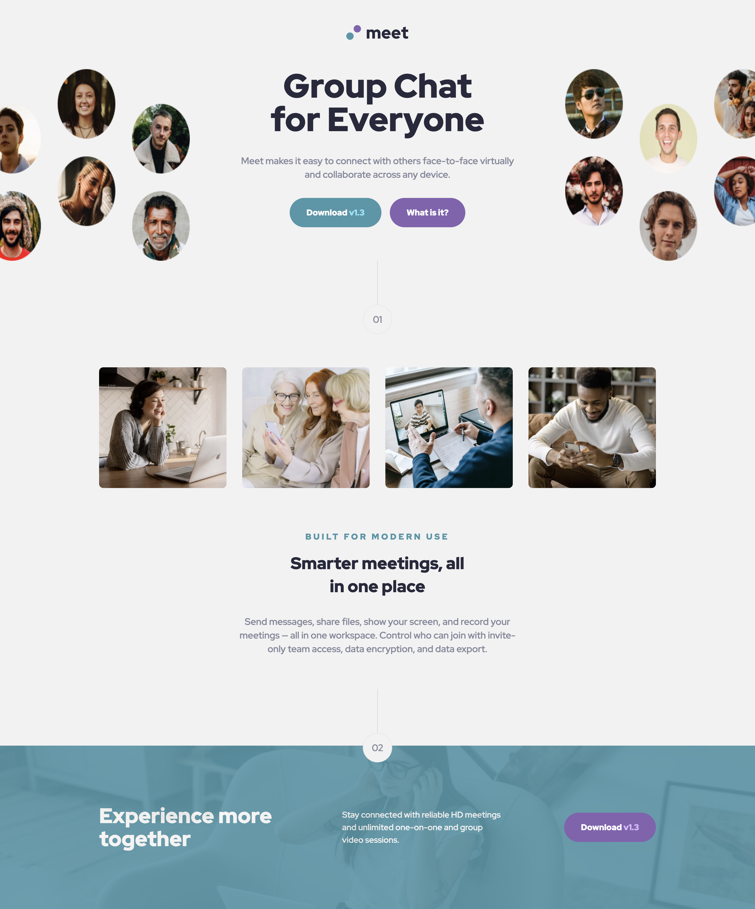

# Frontend Mentor - Meet landing page solution

This is a solution to the [Meet landing page challenge on Frontend Mentor](https://www.frontendmentor.io/challenges/meet-landing-page-rbTDS6OUR). Frontend Mentor challenges help you improve your coding skills by building realistic projects.

## Table of contents

- [Overview](#overview)
- [The challenge](#the-challenge)
- [Screenshot](#screenshot)
- [Links](#links)
- [Built with](#built-with)
- [Author](#author)

**Note: Delete this note and update the table of contents based on what sections you keep.**

## Overview

### The challenge

Users should be able to:

- View the optimal layout depending on their device's screen size
- See hover states for interactive elements

### Screenshot

### Links

- [Solution URL](https://www.frontendmentor.io/solutions/meet-landing-page-V9k7NkQl92)
- [Live Site URL](https://seangray-dev.github.io/FEM-meet-landing-page/)

### Built with

- Semantic HTML5 markup
- CSS custom properties
- Flexbox
- CSS Grid
- Mobile-first workflow
- TailWindCSS

## Author

- Website - [Sean Gray](https://seangraydev.com)
- Frontend Mentor - [@seangray-dev](https://www.frontendmentor.io/profile/seangray-dev)
- Twitter - [@seangray_dev](https://www.twitter.com/seangray_dev)
